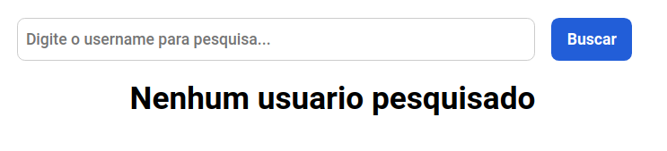
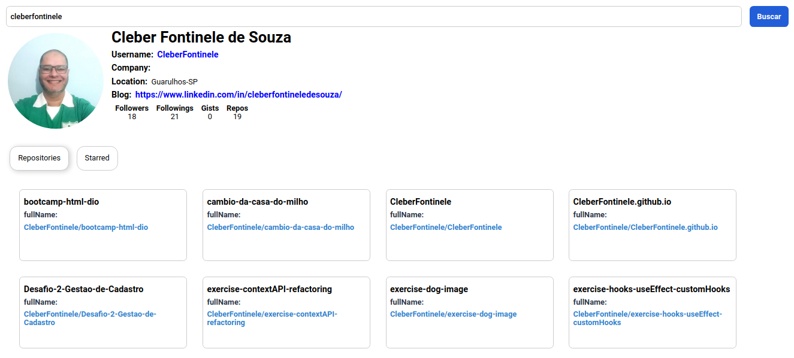

# Github-Api

### Projeto do bootcamp Dio, Localiza labs, feito com ReactJs, ContextApi, Axios, StyledComponents, intuito do Projeto consiste em boas práticas para fazer uma SPA componentizada, que consome a api do github, o usuário pode fazer a pesquisa por um username existente do github renderizando na tela uma lista de todos os repositórios e outras informações.

